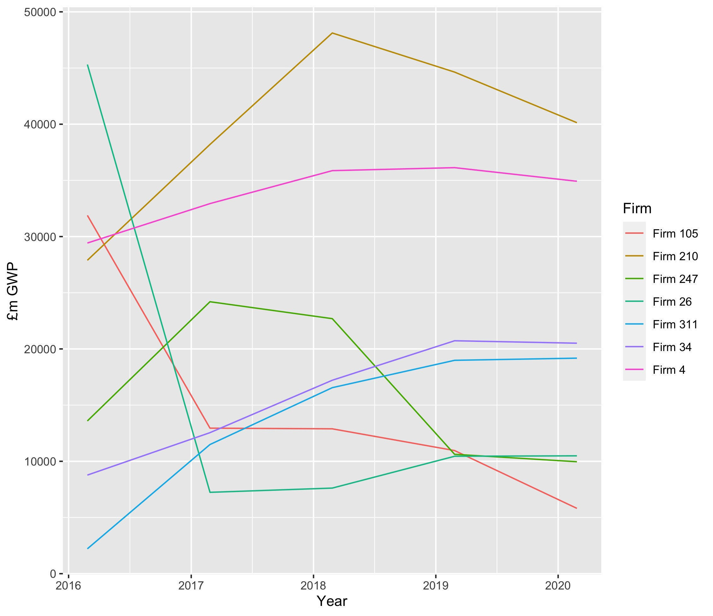
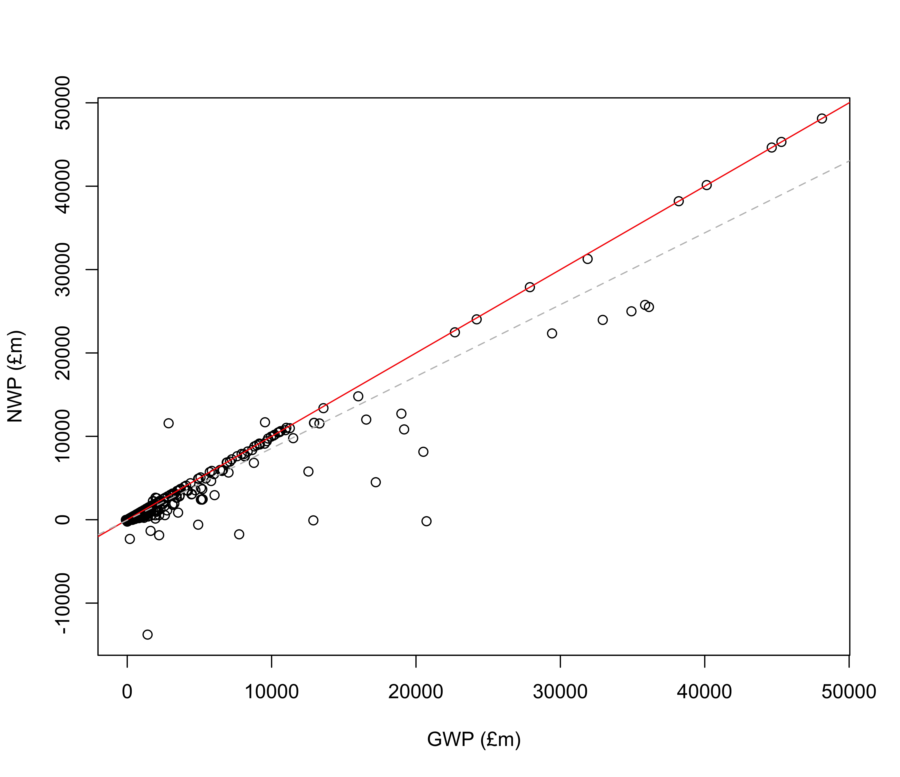
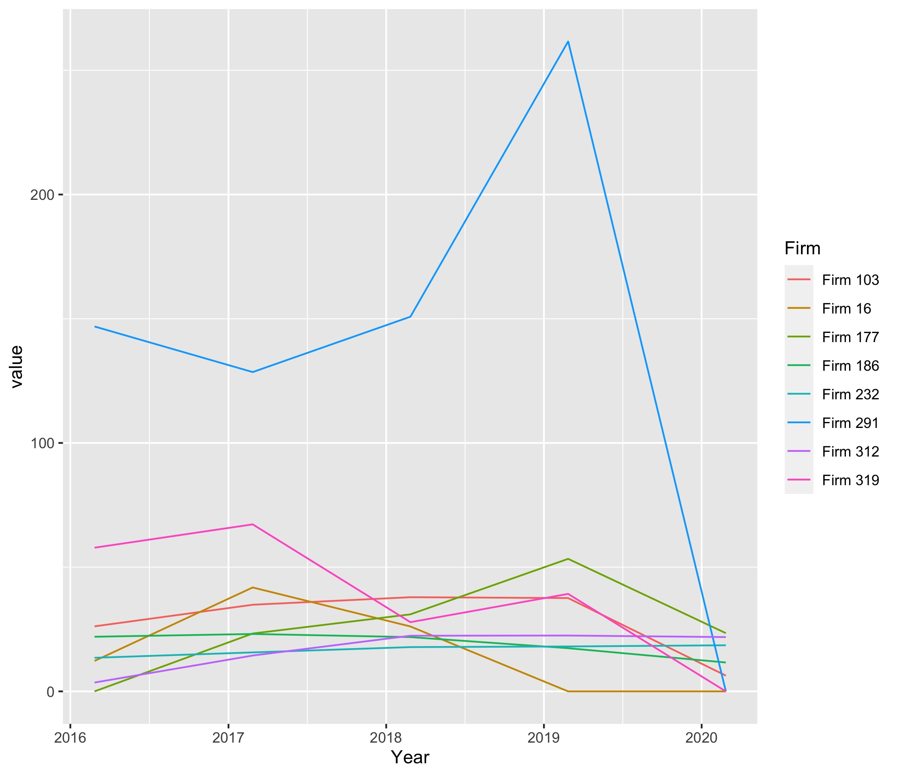
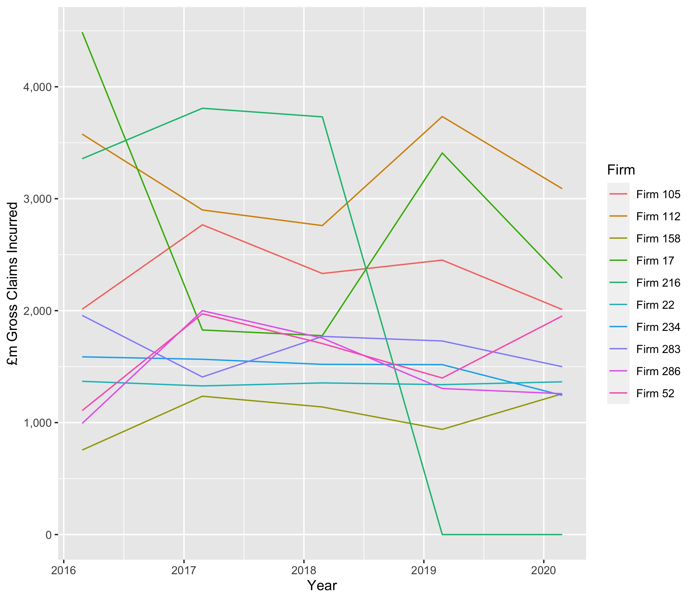
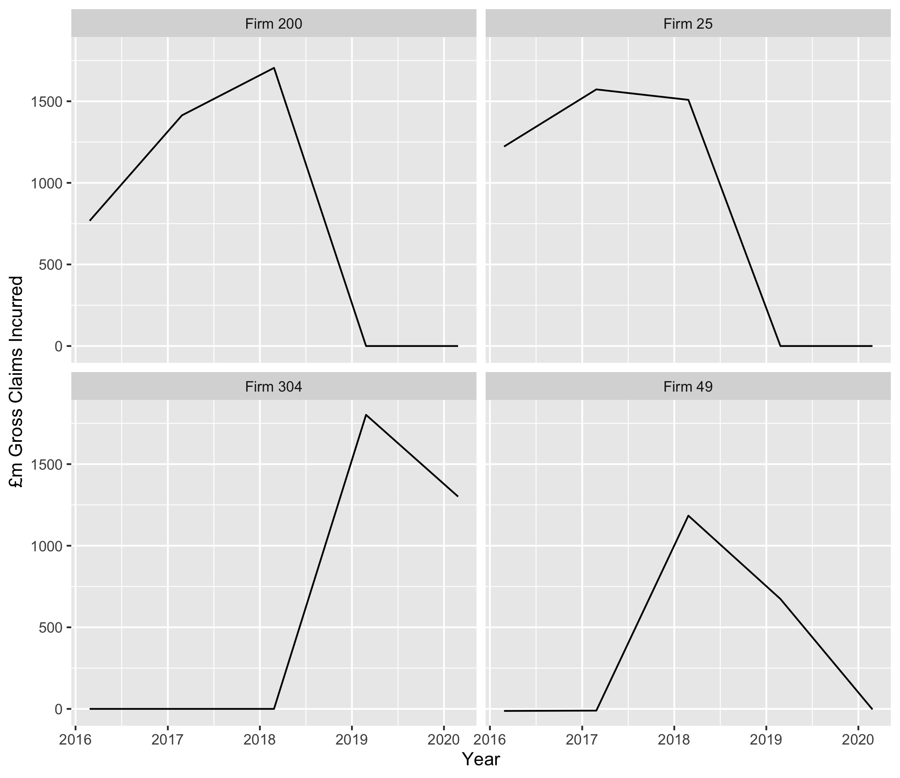
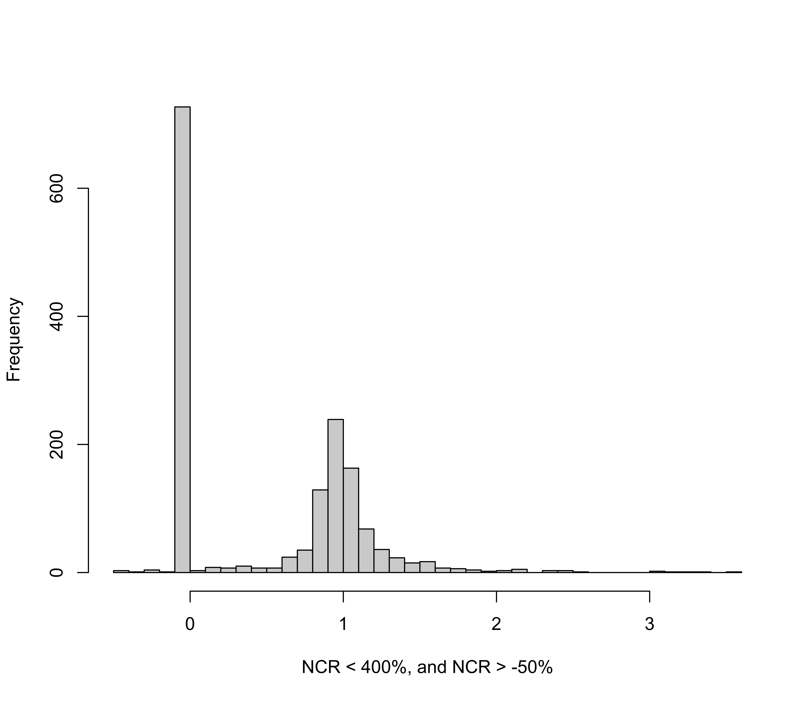
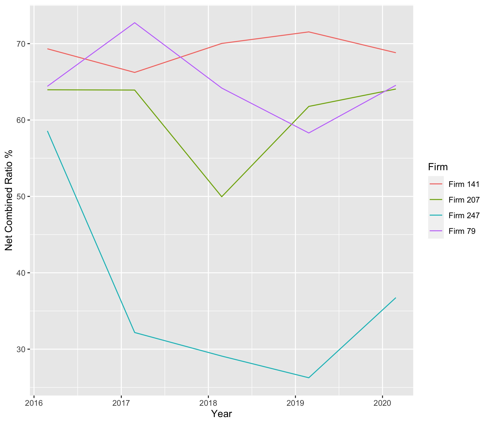
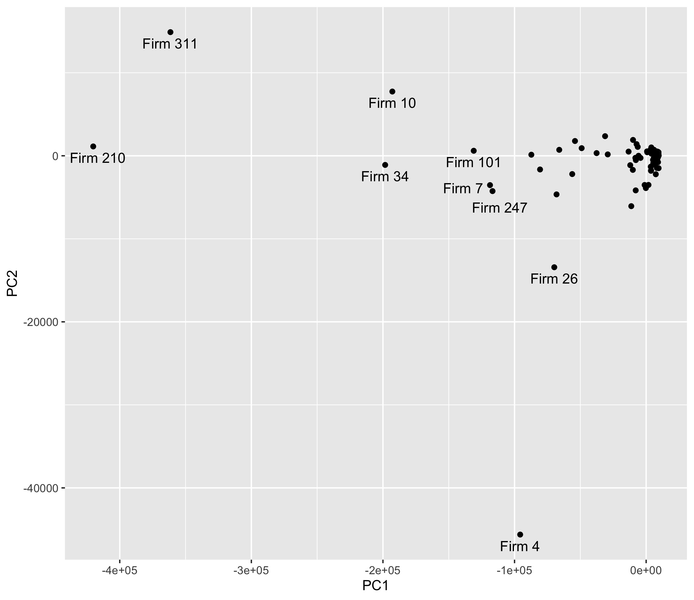

---
output:
  html_document: default
  pdf_document: default
---
```{r include = FALSE}
setwd("~/Documents/JOBS/applications/bank_of_england/data_assessment/analysis/")
```

# Technical Assessment Document

The given data represents finaNCRal information about insurance firms, and is multivariate in nature. Firm size, changing business profiles, and outliers are important in the analysis of this data. Using the programming language R, I have provided an exploratory analysis. The source code can be found in the `./src/analysis.R` file in this repository.

## Analyses

In these analyses I use a mixture of visualisation and modelling to understand which firms are of interest.

### Gross Written Premium (GWP)

Most of the firms in this data set have a GWP of around £920m, taking the average of all values of GWP. To isolate the largest firms, I chose to filter the firms to display by those firms which have on average more than £1000m GWP over the four year period in question (2016-2020). We can display temporal trends of these firms.

```{r pressure, echo=FALSE, out.width = '80%'}

```

The image is a little cluttered, and we can be guided in interpretation of this figure by looking at the variance over time for each firm.

```{r echo = FALSE}
library(data.table)
library(knitr)

var_tabl <- fread("../tables/variance_table.tsv")
colnames(var_tabl) <- c("Firm", "Variance in GWP over time")
kable(var_tabl)
```

Each of the firms in this image would warrant further investigation, but especially firm 26, which has an order of magnitude greater variance in GWP than any other firm. This is shown by the large drop in GWP from 2016 to 2017.

### Net Written Premium (NWP)

NWP is significantly correlated with GWP (p < 0.05), and so as expected the trajectories of each of the largest firms remain similar. Below is a regression of NWP against GWP, showing their high correlation. The red line is the x = y line; where a firm is not reinsuring anything. Most firms are reinsuring something, hence why the grey-dashed line (~ 0.85 slope) is shallower than the 1:1 line. The firms that fall below this line are the most interesting as they are reinsuring more than the average.

```{r echo = FALSE,  out.width = '80%'}

```

There are 23 firms which are reinsuring 75% or more, when we look at mean NWP/GWP for each firm over the four year period. Firms with negative ratios have been removed.

```{r echo = FALSE}
library(data.table)
library(knitr)

div_tabl <- fread("../tables/nwp_div_gwp.tsv")
div_tabl <- div_tabl[V1 >= 0]
colnames(div_tabl) <- c("Firm", "NWP/GWP < 0.25")
kable(div_tabl)
```

### SCR Coverage Ratio

272 out of the 325 firms have across the four year period an average of more than 100%, and so are therefore meeting prudential capital requirements. Some have values much higher than 100%. These are displayed below.

```{r echo = FALSE, out.width = '80%' }

```

This figure above is presented on filtered data where the average SCR ratio over the four year period was higher than 1500% but lower than 1,000,000%. In particular we see high variability in firm 291. We can also present the firms with the very highest SCR ratio. This table below shows firms, by year, where the SCR ratio was higher than 1,000,000%. These firms might be considered outliers in this data set.

```{r echo = FALSE}
library(data.table)
library(knitr)

suspect_scr1 <- fread("../tables/suspect_scr1.tsv")
suspect_scr1[, Variable := NULL]
colnames(suspect_scr1) <- c("Firm", "SCR ratio", "Year")
kable(suspect_scr1)
```

### Gross Claims Incurred (GCI)

128 firms have GCI less than £1 million on average across the four years. These firms, representing over a third of the data set are excluded subsequently. The largest firms display a variety of temporal dynamics. Some firms remain relatively stable (E.g. Firm 22, 234), while others drop precipitously over time (e.g. Firm 216), and yet others are more variable (e.g. Firm 17 which drops and then increases).

```{r echo = FALSE, out.width = '80%'}

```

If we again look at variance through time as we did for GWP, four firms show high variability but are not shown in the plot above. These are Firms 200, 25, 304, and 49. Each of these firms increase in GCI, then drop.

```{r echo = FALSE, out.width = '80%'}

```

### Net Combined Ratio (NCR)

A simple histogram of NCR across all firms and years can be informative. There is an apparent normal distribution with a mean of 1, indicating that the average NCR across many firms and years have an equilibrium of losses and earned premiums. The spike at zero may be because of no earned premiums for a firm in that particular year (this seems to be frequent). Values that lie beyond this plot are considered outliers.

```{r echo = FALSE, out.width = '80%'}

```

If we again visualise over time, but filter for firms which have more than 0% NCR and less than 80% NCR across all years, we find very few firms fitting these criteria. In particular, Firm 247 appears to have a very low NCR.

```{r echo = FALSE, out.width = '80%'}

```

### Summary

The largest firms which average over a billion £GWP each year should be investigated, which are highlighted in the GWP section. Firm 26 in particular shows a large drop in GWP. Although GWP and NWP are correlated, firms which fall below the line of best fit are reinsuring relatively more than other firms. These firms can be easily isolated. In addition, I provide a table to look at those firms which on average over time are reinsuring over 75%. Some firms appear to be reinsuring at 100%.

The SCR coverage ratio represents an interesting variable. Excluding outliers, firm 291 warrants further investigation. If we include outliers however, there are some extremely high SCR coverage ratios present in this data set. Firm 216 spikes in 2017 at over 96 billion percent, which could be an error in the data. Firm 127 has consistently very high SCR coverage ratio. 

For GCI, four firms in particular display interesting temporal dynamics (Firms 200, 25, 304, 49), with peaks and declines in this variable. Lastly, NCR shows a bimodal distribution, and after drilling down presents another four firms which would be worth investigating further.


## Annex: Machine Learning

To gain a more holistic overview of the data set, a useful and commonly used Machine Learning (ML) technique is the Principal Component Analysis (PCA). A PCA tries to explain the variability in a lower number of dimensions than the data set, so it can be visualised. For example, we can combine both data sheets provided, and average across years (move the effect of year to a single data point) to simplify the data. We can then run a PCA across all these 18 variables.

```{r echo = FALSE, out.width='80%'}

```

I have highlighted some firms which appear to deviate highly from the main cluster of points in the top right. Some of these firms (e.g. 210) were already known to us from the above analysis. Others, e.g. Firm 7, have not yet been highlighted and so may be worth investigating for other reasons.
